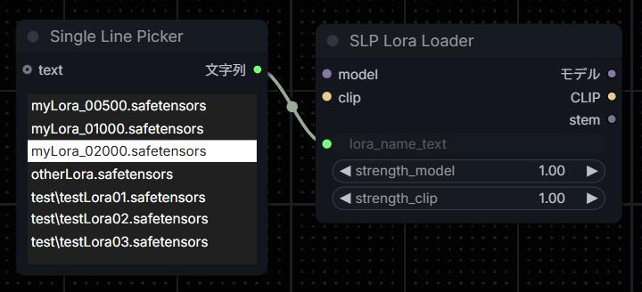
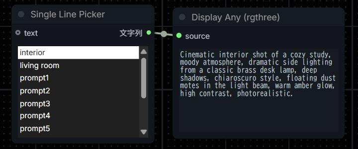
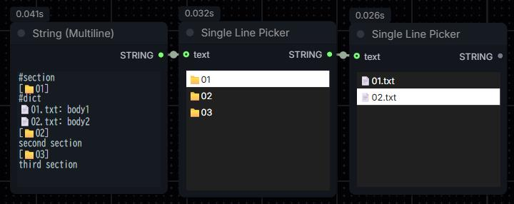
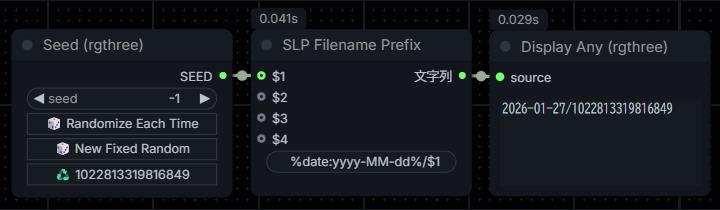

<p align="center">
  <a href="./README.md">English</a> |
  <a href="./README-ja.md">日本語 (Japanese)</a>
</p>

# ComfyUI-SingleLinePicker

This is a custom node for ComfyUI that lets you select single line from lists of text with a single click. It dramatically improves the process of switching LoRA or prompts.



## Nodes

### SLP List View
Displays the input text as a list of individual lines. Outputs the selected line.

Since the output is a string, it cannot be connected directly to a combo box. However, you can feed it by inserting a [ComfyUI-Easy-Use](https://github.com/yolain/ComfyUI-Easy-Use)'s "Show Any (showAnything)" node in between.

The displayed text is reflected by connecting the `text` input to an appropriate node that outputs multi-line text. During the first execution or when the text content changes, the selection state resets and nothing is output. Performing a partial execution from the toolbox that appears when selecting the node allows text to flow in without running the entire process. If the content is static, it's fine to disconnect after it has been loaded once.

You can also change the content by directly editing `source_text` in the Parameters section of the node information panel.

The "Get Lora List" item is added to the node's context menu. Selecting this retrieves a list of installed LoRA files and displays them. You can output directly to the SLP Lora Loader described later.

The "Upload File..." item is added to the node's context menu.
Selecting this allows you to configure settings from a local file. Supported file types include `.csv`, `.tsv`, and `.txt`. `.csv` and `.tsv` files are processed by interpreting the first column as display text and the second column as output text (It is treated as a Section Mode described later.).

**Dictionary Mode**: Entering `#dict` on the first line of text causes subsequent lines to be interpreted as “Display Text: Output Text” separated by colon. This allows you to grasp long contents with concise titles.

Example:
```
#dict
first:output value
second:other value
third:last value
```

**Section Mode**: Entering `#section` on the first line of text, the lines following it will be interpreted and processed as a sequence of "\[display text\](line break) output text".
Enclose the entire line of display text in square brackets, and enter the text to be output starting from the next line. The output text may contain line breaks.

Example:
```
#section
[first]
output value
[second]
other
value
[third]
last value
```



[Python scripts are included](./tools/README.md) that generates formatted text from CSV or text files. By formatting the output text into a SLP List View-readable format, you can recreate a nested list structure. By connecting two SLP List Views and applying them to the first node, you can enable functionality like selecting a category before choosing an item. This can be created using the included script.



> [!WARNING]
>Nodes 2.0 is not supported yet.

### SLP Lora Loader / SLP Lora Loader (Model Only)

It's almost identical to the default loader. Since the LoRA file selection part is text instead of a combo box so that connect a SLP List View directly.

It has an output parameter called `stem`. It outputs LoRA filename without file extension. Available in the next section's SLP Filename Prefix.


### SLP Filename Prefix

Nodes that export files, such as "Save Image" feature a `filename_prefix` parameter that can be set to the current date and time using the `%date:%` format. However, since this is preprocessed by the frontend, it is difficult to combine with backend's runtime output. Connecting an input to `filename_prefix` will not process the date and time.

To resolve this, this node outputs the result of processing the date and time, along with replacing placeholders with strings. You can pass valid value for `filename_prefix` such as "Save Image".

Placeholders can be created up to four: `$1`, `$2`, `$3`, and `$4`. Each is replaced with an input of the same name. Inputs support string and numeric values.




## Installation

Clone the git repository at the location of `ComfyUI/custom_nodes`.

```
git clone https://github.com/hetima/ComfyUI-SingleLinePicker
```
Or search and install from ComfyUI Manager.

No additional pip packages are required.


## Changelog

### 1.2.2
- Added `Get Lora List` to context menu
- Added `Upload File...` to context menu

### 1.2.1
- Change display name from `Single Line Picker` to `SLP List View`

### 1.2.0
- Added `#section` mode
- Added helper scripts: `slp_buld_csv.py` and `slp_build_folder.py`
- Supports connection between SLP List Views

### 1.1.0
- Added new custom node `SLP Filename Prefix`

### 1.0.0
- Initial release
