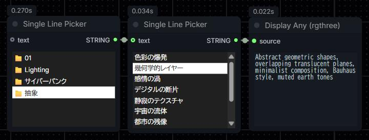

<p align="center">
  <a href="./README.md">English</a> |
  <a href="./README-ja.md">日本語 (Japanese)</a>
</p>

# Tools
[Single Line Picker](https://github.com/hetima/ComfyUI-SingleLinePicker) の動作を補助するPythonスクリプトです。


## slp_buld_csv.py

csvやtsvを読み込んで、Single Line Pickerで使える形式に変換したテキストを書き出します。

```
python path/to/slp_build_folder.py path/to/file.csv
```

と実行すると、.csvや.tsvを1列目を表示テキスト、2列目を出力されるテキストとしてパースし、`#section`形式のテキストファイルをファイル名.slp.txtの名前で保存します。

```
python path/to/slp_build_folder.py path/to/folder
```

と実行すると、フォルダ内のすべての.csv、.tsvファイルをパースします。ファイル名を表示テキスト、前述の方法でパースした内容をbase64エンコードして出力されるテキストとして格納し、output.slp.txtの名前で保存します。`#section`形式の出力が`#section`形式となる二重の入れ子構造になっています。Single Line Pickerを2つ繋げて最初のノードに適用することで、カテゴリーを選んでから項目を選ぶようなことができるようになります。



書き出されたテキストファイルをファイルを読み込むノードでSingle Line Pickerに繋げるか、ノード情報パネルのParametersの`source_text`に内容をペーストすることで内容を適用できます。


## slp_build_folder.py

フォルダを読み込んで、その中の.txtファイルをまとめて、Single Line Pickerで使える形式に変換したテキストを書き出します。

```
python path/to/slp_build_folder.py -d path/to/folder
```

と実行すると、フォルダ内のすべてのtxtファイルをパースします。ファイル名を表示テキスト、内容を出力されるテキストとして格納し、output.slp.txtの名前で保存します。

```
python path/to/slp_build_folder.py -dd path/to/folder
```

`-dd`オプションを付けると、フォルダ内のすべてのサブフォルダに対して前述処理を行い、サブフォルダ名を表示テキスト、処理内容を出力されるテキストとして格納し、output.slp.txtの名前で保存します。入れ子構造になります。

書き出されたテキストファイルをファイルを読み込むノードでSingle Line Pickerに繋げるか、ノード情報パネルのParametersの`source_text`に内容をペーストすることで内容を適用できます。
